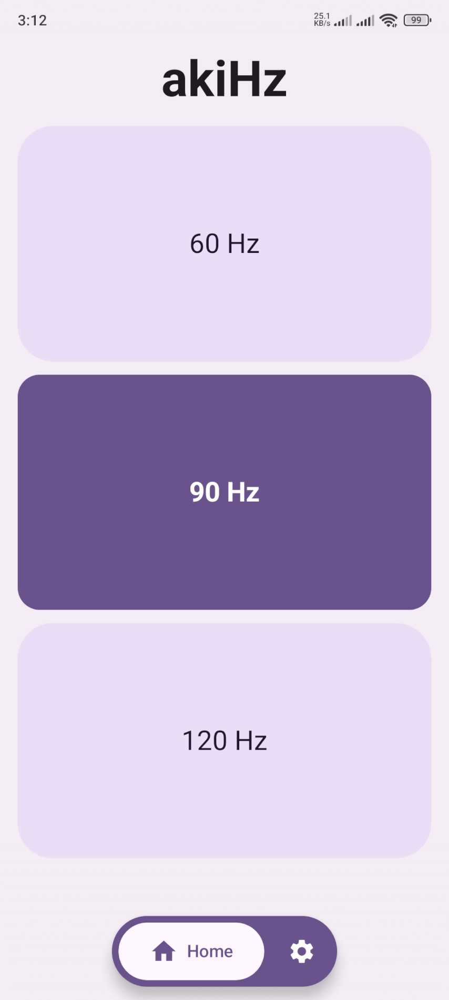
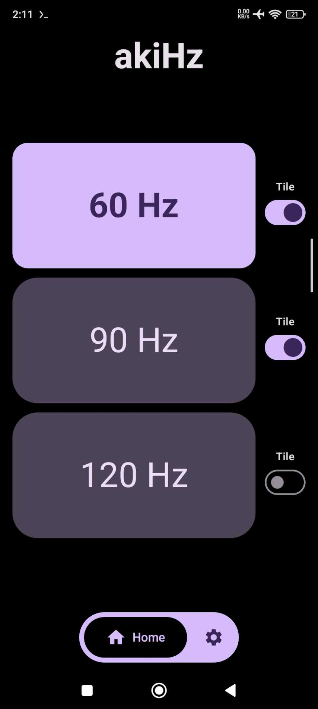
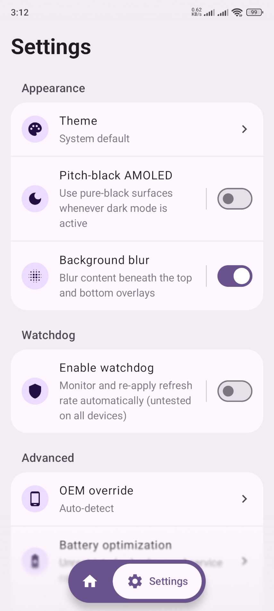
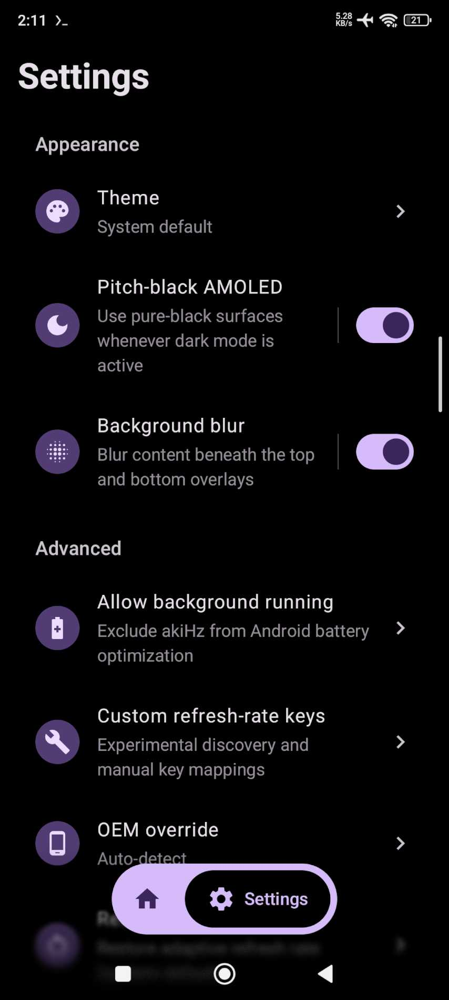

<div align="center">
  

  <h1><strong>akiHz</strong></h1>

  <h3>Android refresh rate switcher (FOSS)</h3>

  <p><strong>akiHz</strong> (pronounced "akiHertz") is a lightweight, open-source Android app that lets you instantly change your device's refresh rate (60Hz / 90Hz / 120Hz / etc.) using <a href="https://shizuku.rikka.app/">Shizuku</a>. No root required.</p>

  <p>Features a Quick Settings tile for one-tap cycling, automatic detection of supported refresh rates, and OEM-specific settings support.</p>

  <p>
    <a href="LICENSE"></a>
    <a href="app/build.gradle.kts"></a>
    <a href="https://github.com/anlaki-py/akihz/releases/latest"></a>
  </p>
</div>

---

## Download

Download the latest APK from [GitHub Releases](https://github.com/anlaki-py/akihz/releases/latest).
Most modern phones use the `arm64-v8a` APK; choose the `universal` APK if you
are unsure which architecture your device uses.

## Requirements

- [Shizuku](https://shizuku.rikka.app/) installed, running, and authorized
- A display that supports more than one refresh rate
- No root access required

## Supported Android versions

akiHz supports **Android 11 and newer (API 30+)** and currently targets API 36.

## Screenshots

| Home (light) | Home (dark) |
|:---:|:---:|
|  |  |

| Settings (light) | Settings (dark) |
|:---:|:---:|
|  |  |

## Features

- **Dynamic detection:** automatically reads your display's supported refresh rates instead of using hardcoded values
- **Quick Settings tile:** tap to cycle through rates instantly; long-press to open the app
- **Custom tile cycle:** include or exclude each detected rate from the Quick Settings tile on Home
- **Automatic update alerts:** checks GitHub on a daily, three-day, or weekly schedule and notifies once per release
- **Reliable background access:** a foreground service keeps tile controls ready, with a settings shortcut for disabling battery optimization
- **Multi-OEM support:** targets the correct system settings keys per manufacturer
- **Instant switching:** no artificial delays; the rate changes as soon as you tap
- **OEM override:** manually pick a device profile in Settings if auto-detection does not match your phone
- **True-black AMOLED mode:** uses pure `#000000` surfaces when dark mode is active

## Supported devices

I have only tested akiHz on my Xiaomi phone. The app includes support for
several other manufacturers and many other devices should work, but none are
tested or guaranteed.

If auto-detection fails, try **Settings → Advanced → OEM override** and select
your manufacturer manually.

## Install

Each release provides standalone APKs for `arm64-v8a`, `armeabi-v7a`, `x86`,
and `x86_64`, plus a `universal` APK. Most modern phones use `arm64-v8a`;
use `universal` if you are unsure.

akiHz also includes an in-app updater. When installing an update downloaded
inside the app, grant the **Install unknown apps** permission for akiHz when
prompted by your device settings.

Releases from `main` are stable. Releases from `beta` are marked as GitHub
prereleases. Both channels use the same application ID and signing key, and
monotonically increasing version codes, so a newer beta can update an installed
stable release without uninstalling it.

GitHub release assets use predictable names and include SHA-256 checksums and a
machine-readable `release-metadata.json` file for release indexers and Android
update clients. The metadata includes canonical project and release links,
release date, Shizuku requirement, APK download URLs, and the signing
certificate fingerprint shared by every APK variant.

See [CHANGELOG.md](CHANGELOG.md) for the complete release history.

## Usage

1. Open Shizuku and start it (wireless debugging or ADB)
2. Open akiHz and grant Shizuku permission
3. Select a refresh rate from the buttons, or add the **akiHz** tile to your Quick Settings panel and tap it to cycle
4. For more reliable background operation, open **Settings → Advanced → Allow background running** and approve the Android prompt

## FAQ

**Why does Shizuku need to be running?**  
Android blocks normal apps from changing refresh-rate settings directly. Shizuku grants akiHz the privileged access needed to update the correct OEM-specific keys.

**Does the Quick Settings tile work when the app is closed?**  
Yes. akiHz uses an ongoing foreground service to keep its Quick Settings controls ready. Android displays a persistent notification while it runs. If your device still restricts it, use **Settings → Advanced → Allow background running** to request a battery-optimization exemption.

**My phone is not switching rates correctly? What should I try?**
1. Confirm Shizuku is running and akiHz has permission  
2. Try **Settings → Advanced → OEM override** and pick your manufacturer  
3. If it still does not work, fork the project and investigate support for your device

**Is akiHz safe?**  
The app is MIT-licensed and fully open source. It only changes display refresh-rate related system settings; review the code on GitHub if you want to verify behavior.

## Contributions and support

This project does not provide support and is not accepting bug reports or
feature requests. You are welcome to fork it and make your own changes.

More projects by the developer are available at [anlaki.dev](https://anlaki.dev/).

## Build

```bash
./gradlew assembleDebug
```

## License

[MIT](LICENSE)

## Project status and disclaimer

This is a personal app I vibe-coded to solve a problem I had. It is provided as
is, with no promise of quality, reliability, compatibility, maintenance,
support, or future updates. Development may slow down or stop permanently at
any time and without notice.

Please treat this repository as something to download and use at your own risk,
or fork and maintain yourself. Do not open issues asking for support, bug fixes,
device compatibility, features, or updates. If the app does not work for you,
you will need to diagnose and fix it yourself.

To the fullest extent permitted by law, I accept no responsibility or liability
for any damage, data loss, device problems, security issues, or other
consequences resulting from installing, using, modifying, or relying on this
app.
